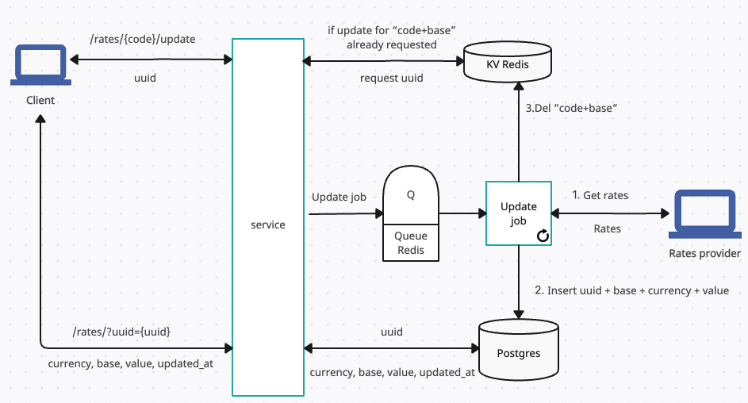

# Currency rates service

Service provides an async interface, where the user first makes a request to update the currency rate, and then, after some time, requests the rate. 

To run service locally clone the project and run from the root:
```
make start
```
Service is exposing port`:8080`.
Swagger docs: http://localhost:8080/api/v1/swagger/index.html#/

Base currency is `USD`. The following currencies are supported: `USD`, `EUR`, `MXN`. Info is provided by [VAT comply](https://www.vatcomply.com/documentation#rates-base). Currency rates tracks foreign exchange references rates published by the European Central Bank.
 

1. Send a PUT request to initiate an exchange rate update and receive a UUID. Optionally, specify the base currency with `?base={base}`.
```bash
curl -X PUT http://localhost:8080/api/v1/rates/eur/update

{
  "Base": "USD",
  "Currency": "EUR",
  "UUID": "2c63ba98-0908-4598-8c7c-870b9d83f3e9"
}
```
2. Retrieve the updated exchange rate by calling `GET /rates?uuid={uuid_from_previous_step`}.
```bash
curl -X GET http://localhost:8080/api/v1/rates?uuid=2c63ba98-0908-4598-8c7c-870b9d83f3e9

{
  "updated_at": "2024-02-29 22:38:18.788931 +0000 UTC",
  "base": "USD",
  "currency": "EUR",
  "value": 0.9237021803855896
}
```
3. Get the latest currency rate from the database `GET /rates/{code}?base={base}`. Default base is `USD`.
```bash
curl -X GET http://localhost:8080/api/v1/rates/eur

{
  "updated_at": "2024-02-28 20:00:28.525431 +0000 UTC",
  "base": "USD",
  "currency": "EUR",
  "value": 0.9237021803855896
}
```
### How update works
The service workflow is presented in the image below.

If an update job fails, it will be retried 5 times. If a job returns an error or panic, we'll see how many retries a job has left. If it doesn't have any, we'll move it to the dead queue. If it has retries left, we'll consume a retry and add the job to the retry queue.
